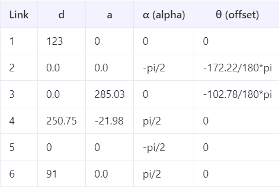
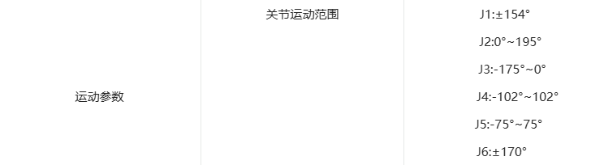

# Piper Kinematics

These files provides forward and inverse kinematics implementations for the Piper robot arm, based on the Denavit-Hartenberg (DH) parameters.
(It seems like [AgileX's code contains the pinocchio function in their repository](https://github.com/agilexrobotics/piper_ros/tree/noetic/src/piper/scripts/piper_pinocchio) for such process. However, since it only supports ROS1 noetic, I have created [a version for ROS2 humble](https://github.com/CodeHesed/piper_ros/tree/humble/src/piper/piper_pinocchio).)

## Files

- `piper_dh_params.py`: Contains the DH parameters, joint limits, and gripper offset for the Piper robot.
- `piper_kinematics.py`: Implements forward and inverse kinematic functionss for both gripper base and gripper center.
- `piper_kinematics_visualizer.py`: Visualization tool for kinematic chains.

## Usage Example

### Forward Kinematics

```python
import numpy as np
from piper_kinematics import forward_kinematics_gripper_base

joints = np.array([0.0, 0.0, 0.0, 0.0, 0.0, 0.0])
gripper_base_T = forward_kinematics_gripper_base(joints)
print("End-effector pose:\n", gripper_base_T)
```

### Inverse Kinematics

```python
from piper_kinematics import inverse_kinematics_gripper_center

target_gripper_base_pose = np.eye(4)
joints = inverse_kinematics_gripper_base(target_gripper_base_pose)
if joints is not None:
    print("Solved joint angles:", joints)
else:
    print("No solution found")
```

## Notes

- The DH parameters and joint angle limits are based on official document version V1.1.1 (updated on 2025.04.02)
<br> 
<br> 
- Inverse kinematics uses numerical optimization with joint limits
- The visualizer script provides 3D visualization of kinematic chains